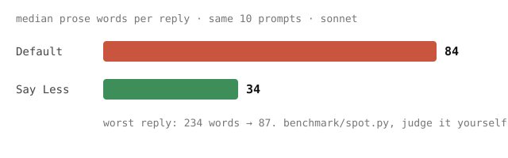

# Say Less

Claude Code writes too much. Say Less is a Claude Code plugin that cuts word
count by a median 71%, up to 80%. Reasoning and coding behavior are unchanged;
only the reply gets shorter.



**Status: beta.** It works and it's measured, but the style is still moving.
Try it on real work and tell me where it falls short.

## See the difference

Same question, same model. Both sides start from a clean slate, so no personal
`CLAUDE.md` or installed plugin can shorten either one. The style is the only
difference.

> **Q: What's the difference between Git and GitHub?**

<table>
<tr>
<th align="left" width="50%">Claude Code &middot; 122 words</th>
<th align="left" width="50%">Claude Code with Say Less &middot; 56 words</th>
</tr>
<tr>
<td valign="top">

Git and GitHub serve different purposes:

**Git** is a version control system &mdash; a command-line tool (or library) that tracks changes to files over time, lets you branch, merge, and revert code. It runs locally on your machine and doesn't require the internet or any company's servers.

**GitHub** is a cloud hosting platform built around Git. It stores your Git repositories remotely and adds collaboration features on top: pull requests, issue tracking, code review, CI/CD, project boards, etc.

Analogy: Git is like the concept of "saving drafts and tracking edits" of a document; GitHub is like Google Drive &mdash; a place to host those files online and collaborate with others. Alternatives to GitHub include GitLab and Bitbucket, which also use Git under the hood.

</td>
<td valign="top">

Git is a version control tool: it tracks changes to files locally on your machine (commits, branches, history).

GitHub is a hosting service built around Git: it stores your Git repos in the cloud and adds collaboration features (pull requests, issues, code review, CI). You could use Git without ever touching GitHub (or use GitLab/Bitbucket instead).

</td>
</tr>
</table>

Same answer, 54% less to read. Ask it your own question and watch both stream:
`python3 benchmark/serve_compare.py`.

## Install

Paste this into any Claude Code session and it works out where it's running:

```
Install the Say Less plugin from mooch-agency/say-less.

Use /plugin if it's available; if not, add it to .claude/settings.json.

When it's done, run `/reload-plugins`, then ask what the default Postgres port is. Say Less answers "5432."; the default answer is a full paragraph.
```

Or do it yourself. **In the terminal or the desktop app**, run these two inside
a Claude Code session:

```
/plugin marketplace add mooch-agency/say-less
```

```
/plugin install say-less@say-less
```

Then restart the session. That's it, no config.

**On the web** ([claude.ai/code](https://claude.ai/code)), `/plugin` isn't
available, so commit this to `.claude/settings.json` in your repo instead:

```json
{
  "extraKnownMarketplaces": {
    "say-less": {
      "source": { "source": "github", "repo": "mooch-agency/say-less" }
    }
  },
  "enabledPlugins": { "say-less@say-less": true }
}
```

Every cloud session on that repo picks it up. Works in the terminal and desktop
app too, and it's the one to use if you want a whole team on it.

To turn it off: `/plugin disable say-less`. Per-surface detail, the shell
equivalents, and troubleshooting are in [INSTALL.md](INSTALL.md) &mdash;
including the plain output-style version with no plugin at all.

## Test it yourself

```bash
python3 benchmark/serve_compare.py     # localhost:8787, ask anything, watch both stream
python3 benchmark/compare.py "..."     # same thing, one prompt, in the terminal
python3 benchmark/spot.py "Say Less"   # 10 fixed prompts with word counts
```

Both sides start from a clean slate, so your own `CLAUDE.md` and plugins can't shorten either one. No judges, no scores: read them and decide.

## Why it's built this way

Telling a model to be concise barely works. Showing it short answers does, so
the style file is mostly examples, and replies come out the length of those
examples.

Three things that turned out to matter:

- **One line carries the bound**: "the whole reply is 1-4 lines". Take that
  line out and replies grow straight back.
- **Naming sections makes replies longer, not shorter.** So the style says
  nothing about how to structure an answer.
- **On Opus, replies drift back toward normal length as a session runs on.**
  Repeating the rule at every turn fixes it, which is what the optional hook in
  [`benchmark/hooks/`](benchmark/hooks/) does. It ships off by default.

## How the numbers were measured

10 questions, asked 3 times each, to a plain Claude Code and to one running Say
Less. Every run starts from a clean slate (`--setting-sources project`): no
personal `CLAUDE.md`, no settings, no other plugins, so nothing outside the
style can shorten either answer.

**Say Less was shorter on all 10, by 61% to 80%.** A script does the counting
(`total_words`); no model grades the result. Code blocks count as words,
because you still have to read them: ignoring code once scored Say Less as
*longer* on a Docker question when it had in fact produced half the reading.

Full findings, with data: [benchmark/RESEARCH.md](benchmark/RESEARCH.md),
[benchmark/results/](benchmark/results/). Reproduce the headline number:
`python3 benchmark/paired.py`.

## Feedback

Hit a reply that stayed too long, or worse, dropped something it should have
kept? Open an issue with the prompt that caused it. Both failure modes are
useful to hear about; that's what the beta is for.

## Status

The shipped style is `output-styles/say-less.md`; earlier drafts are in
`versions/` with their benchmark numbers in `benchmark/results/`.
