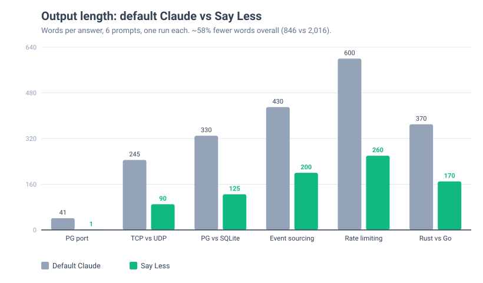

# Say Less

A low-verbosity output style for Claude Code. Full reasoning, terse replies.

Claude keeps all its coding ability and works at full depth. Only the final reply changes: shortest clear answer, plain and direct, none of the AI padding.

## What it does

- Leads with the answer, one word where that's enough ("5432.").
- Cuts the patterns that bloat replies and mark text as AI-written: hedging, comparative antithesis ("Not X. Y."), sycophancy, promotional adjectives, warm closes, em dashes.
- Keeps code, commands, and exact values verbatim.

The approach is negative space: ban the ~14 tics that pad writing, and what's left is terse. Ported from a personal low-verbosity assistant profile and validated by testing.

## Measured effect

Same 6 prompts, answered with and without the style:



~58% fewer words overall, and the cuts are padding: every answer still leads with the call and keeps its tables. Numbers are one run per prompt, word counts by inspection; regenerate or harden with `python3 benchmark/build_chart.py`.

## Install

```bash
ln -sf "$(pwd)/say-less.md" ~/.claude/output-styles/say-less.md
```

Then turn it on: `/config` -> Output style -> Say Less, or add `"outputStyle": "Say Less"` to `~/.claude/settings.json`. Takes effect in a new session.

`keep-coding-instructions: true` in the frontmatter means all default coding behaviour stays; only the prose style changes.

## Status

Dogfooding. Built and validated, not yet packaged as a plugin or published.
